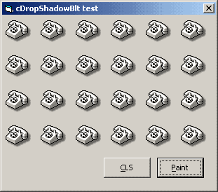



## cDropShadowBlt 1\.1\.1 \(icons supported\)

### Description

Simple rendering/painting class for 'drop-shadow' effect. Three methods: CreateFromStdPicture, CreateFromDC and Paint. Shadow options: opacity [0,100], xOffset [1+] and yOffset [1+]. // 5Kb. 

----

Added 'ShadowColor' option and slightly improved 'pvRenderDropShadow' routine (now maping DIB bits: no buffers and '1-pass' blurring). 

----

Icons supported. New generic method name: CreateFromHandle(). 

----

Fixed shadow left-top edges.
 
### More Info
 

             |
---                |---
**Submitted On**   |2005-03-26 15:50:40
**By**             |[Carles P\.V\.](https://github.com/Planet-Source-Code/PSCIndex/blob/master/ByAuthor/carles-p-v.md)
**Level**          |Intermediate
**User Rating**    |5.0 (75 globes from 15 users)
**Compatibility**  |VB 6\.0
**Category**       |[Graphics](https://github.com/Planet-Source-Code/PSCIndex/blob/master/ByCategory/graphics__1-46.md)
**World**          |[Visual Basic](https://github.com/Planet-Source-Code/PSCIndex/blob/master/ByWorld/visual-basic.md)
**Archive File**   |[cDropShado1869683302005\.zip](https://github.com/Planet-Source-Code/carles-p-v-cdropshadowblt-1-1-1-icons-supported__1-59604/archive/master.zip)

